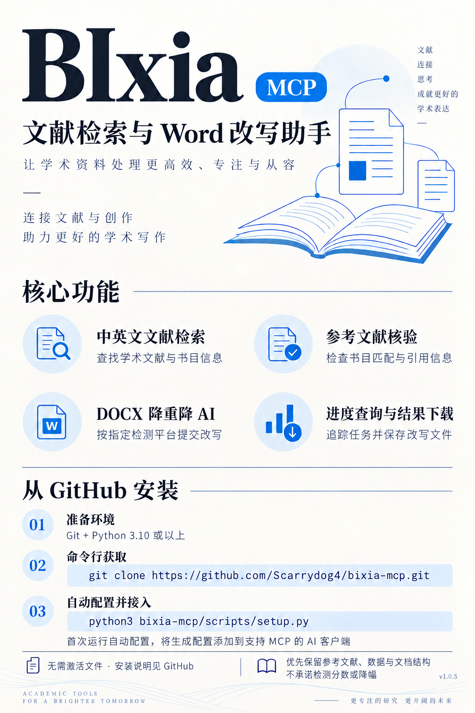

# BIxia MCP

同一套标准 stdio MCP 工具，提供中文/英文文献检索、参考文献核验，以及 Word 文件双降。文献下载已关闭。工具说明自带使用流程；接入不依赖 Codex 插件或某个 Agent 的技能系统。可在支持本机 stdio MCP 的客户端使用；无法直接在没有本机 MCP 功能的纯网页聊天中运行。

## 从 GitHub 安装：无需激活文件

需要 **Git** 与 **Python 3.10 或以上**，无需第三方 Python 包。首次运行会自动连接服务、领取独立的本机访问配置；已有配置继续使用。

macOS / Linux：

```bash
git clone https://github.com/Scarrydog4/bixia-mcp.git
python3 bixia-mcp/scripts/setup.py
```

Windows PowerShell（需要 Git 与 Python 启动器）：

```powershell
git clone https://github.com/Scarrydog4/bixia-mcp.git
py -3 bixia-mcp/scripts/setup.py
```

脚本会输出接入用的 JSON。将其中 `bixia-mcp` 条目合并到支持**本机 stdio MCP** 的 AI 客户端配置中，保留已有的其他服务器，随后重启客户端。生成的接入配置位于 `~/.bixia-mcp/mcp-servers.json`。初次直接启动 MCP 服务时也会自动准备连接配置。

已经克隆过的电脑，进入 `bixia-mcp` 仓库目录更新后运行：

```bash
git pull --ff-only
python3 scripts/setup.py
```

安装只配置连接，不提交论文或创建改写任务。每台电脑有独立的访问配置与任务空间；本机连接信息自动保存为私有文件。公开仓库不含网站凭据、管理员密钥或后台代码。首次配置需要联网，服务暂不可用时会明确报错。安装目录移动后请重新运行 `setup.py` 更新路径。

旧版手动激活方式仍兼容：有个人激活文件时可使用 `scripts/activate.py`，或向 `setup.py` 传入 `--activation`；普通新安装不需要这些步骤。

## 接入你的 Agent

`examples/mcp-servers-macos.json`、`mcp-servers-linux.json`、`mcp-servers-windows.json` 是通用配置模板。替换三处实际绝对路径：Python可执行文件、`scripts/bixia_client.py`、本人私有配置。JSON里的`command`仅放可执行文件，参数单独放`args`；不要写`py -3`作为command，不依赖插件路径宏。MCP配置只包含私有配置路径，访问密钥不写进此JSON。

- Claude Desktop：设置 → Developer → Edit Config，将模板中的服务器条目合并进已有`mcpServers`，重启客户端。[官方接入说明](https://modelcontextprotocol.io/docs/develop/connect-local-servers)
- Cursor：将条目合并进个人`~/.cursor/mcp.json`或项目`.cursor/mcp.json`。[官方MCP说明](https://prod.cursor.com/docs/mcp)
- Cline：MCP Servers → Configure → Configure MCP Servers，合并同一条目；CLI可使用`~/.cline/mcp.json`。[官方配置说明](https://docs.cline.bot/mcp/mcp-overview)
- Cherry Studio：设置 → MCP → 添加本地stdio服务器，填同一command、逐项args和UTF-8环境变量；启用并绑定到需要使用的Agent。支持JSON导入的版本也可导入模板。[官方说明](https://docs.cherryai.com.cn/advanced-basic/extensions/mcp)
- Codex：可以使用随包插件，或将对应`examples/codex-*.toml`合并到自己的MCP配置。插件技能是附加帮助，标准工具可独立使用。[官方MCP说明](https://developers.openai.com/codex/mcp)

请合并自己的已有配置，避免覆盖其他服务器。启用后检查是否显示8个工具，并先调用`service_capacity`或`list_platforms`验证连接；它们不会创建改写或下载任务。

## 怎么使用

“帮我找社区图书馆服务研究的文献”：使用`literature_search`；英文使用`literature_search_en`。核验参考文献用`literature_verify`，有DOI时优先核对DOI。文献下载已关闭，不提供论文文件或文献下载任务。不要把检索结果、摘要或书目匹配当成已经取得和阅读全文。

“给这个Word文件降重降AI”：先提供本机DOCX路径（DOC须先另存为DOCX），并确认目标检测平台。没有默认平台，Agent必须询问；`list_platforms`提供选项。输入最多10MB，默认CN，可选支持EN的平台，固定双降及文件改写Pro功能，不能改为单项模式或自行换平台。`rewrite_file`提交后，用`job_status`查询，用`get_result`另存结果（最多40MB）到用户指定目录。Pro指文件改写功能，不表示所有平台底层模型相同。

网络中断时保留原job_id，只查询原任务。相同输入再次调用会恢复原任务；不要通过新id盲目重复提交。改写完成后仍须检查事实、数字、限定语与语义；完成状态不能证明检测分数下降。

`service_capacity`返回检索、文件改写并发和服务状态；`downloads_enabled=false`表示文献下载已关闭，历史下载额度与统计不表示可以继续下载。日期与统计由中央服务计算，配置上限不是实测吞吐。Word改写结果仍通过`get_result`保存到本机；此工具只用于Word结果，不是文献下载。

通用Skill在`skills/bixia-mcp/SKILL.md`，可按各Agent的技能加载方式使用，或供人工阅读；未加载Skill也能使用工具。配置支持`BIXIA_MCP_URL/KEY/CA_FILE/CONFIG`，同时兼容`ACADEMIC_REWRITE_*`。密钥不要写进聊天、CLI参数、公开仓库或公开MCP配置。

中央服务保留处理逻辑与后台凭证，公开包只含薄客户端、公共证书、模板及Skill。客户端和协议可以被分析，这种部署不承诺绝对防反编译。

兼容范围：标准本机stdio MCP，协议版本2024-11-05、2025-03-26、2025-06-18；合法_meta和空分页cursor可使用。macOS/Linux已进行本机自动化测试，Windows路径、UTF-8与ACL分支经过模拟测试，尚未在真实Windows机器验收。不同Agent的界面入口会随版本变化，以官方说明为准。

## 1.0.4 内容保护

返回稿以原稿OOXML框架重建：参考文献、数字/统计/范围限定段、表格、公式、引用和复杂结构保留原稿，仅接受可可靠映射的普通叙述改写。上游原始返回由中央服务独立保留，历史任务查询时也适用，不重复收费提交。段落结构不能对应时document_integrity终止交付。DOC和不受支持的结构在付费前拒绝。

工具返回content_protection采纳/恢复/拒绝计数及quality_status。limited_rewrite表示大量原文保留，实验论文可改范围可能很小，不能宣称全文双降有效。保护不等于语义或排版全面通过，更不能证明检测分数降低；仍需对照原稿复核和真实检测报告。

全段均需保护的稿件返回no_safe_text，在上传和收费提交前停止。已有任务保持原ID恢复，不为内容保护重新提交。

## 功能与安装海报


